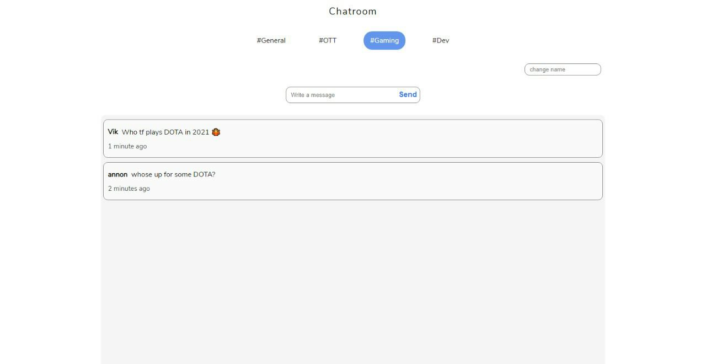

# ChatRoom

an open chatroom with nothing but VanillaJs + Firebase.  i could have used modern frameworks instead of VanillaJs but wanted to keep it as based as possible.

## Link

[Worldtime](https://brijrajparmar27.github.io/Chatroom/)

 

